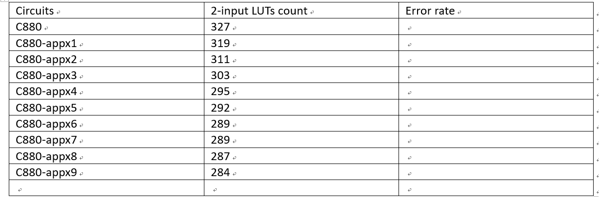
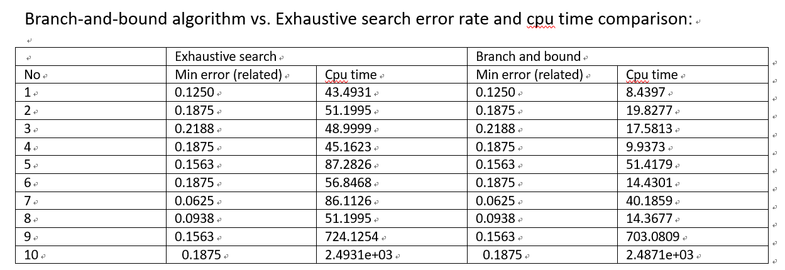

# VE490 Weekly Report 3

[TOC]

## Maximum Fanout Free Cone:

Definition  **Fan In / Fan Out**:
> the output of gate $v$ is an input of gate $w$, in which case $v$ is called a fanin of $w$ and $w$ is a fanout of $v$

Defiiniton: **Primary Input (PI) and Primary Output (PO)**
> A primary input (PI) node has no fanin and a primary output (PO) node has no fanout, and a node with both fanins and fanouts is an internal node. 

Definition: **Successor and predecessor**
> If there is a path from node $v$ to node $w$, $v$ is a predecessor of $w$ and $w$ is a successor of $v$.

Definition: **Fanout free**
>A node $v$ is fanout-free if $|output($v$)|\leq 1$

Definition: **cone of $v$**:

>Given a node $v$ in the network $N$, a cone of $v$, denoted as $C_v$, is a sub-network of $N$ consisting of $v$ and some of its non-PI predecessors such that for any node $w \in C_v$, there is a path from $w$ to $v$ that lies entirely in $C_v$. Node $v$ is called the root of $C_v$. 

Definition (Maximum) *Fanout-free cone**:

>A fanout-free cone (FFC) is a cone in which the fanouts of every node other than the root are in the cone (i.e., they converge to the root). For each node $v$ there is a unique maximum fanout-free cone (MFFC) of v which contains every FFC rooted at $v$.

Disscussion of the usage see "Transcript".

## Discussion with Wang

This section contains discussion with Wang Chen.

### Did you complete consider all the combinations:
Yes, we did.  We enumerated all possible structure.  This enumeration results are shown in the table as the "Exhaustive Search" part.

### Is this process a greedy process:
Not exactly. The although the methodology says:
> Instead, it get the all the error rate level by level, and use the minimum error rate of a certain level to prune those nodes on this level with error rate larger than it (as done by the function “get_appx_error_this_level()” to get the minimum error rate of all nodes in this level)

Chen answers the following:
1. The algorithm throughs away all the sub-optimal results
2. It is possible to have multiple optimal results, the algorithm searches all of them. 

Thus it is eventually an "almost" greedy algorithm. According to Chen the experiment results are in "Branch and bound" column. But there are some inconsistency, a discussion is given in the comments.

### What is the tool chain:
The automatic experimental flow (already implemented):
1. **Identify MFFC**: 
* Use the cpp program to find MFFCs with a number of inputs. Choose one with the most potential area-saved to approximate, print out their `.blif` files and minterms. 
2. **Approximate the MFFC** 
* Use perl program to parse the minterms into truth table. 
* Input the truth table to the matlab program, get the approximated circuit in .blif file 
3. **Determine the error rate** 
* Use approximated circuit `.blif` file to replace the previous corresponding `.blif` parts. 
* Use VCS to simulate and get the overall approximation error rate.
4. **Iterate until error is bounded** If the error rate is less than a given threshold, loop back to 2; Else terminates.

Notes:
* `.blif` files are files that describe the BDD of a circuit. It's used in the Berkly programe.
* The major part of the algorithm is written in Matlab.
* All steps are now done

### How is the experiment results, what do you think.

This is the result for c880 circuit (383 gates).  From the result we see that the circuit saves on everage 70 gates, about 16% of the gates. It is not very ideal. 

Chen proposes further simpify the circuit using 3 input LUTs.

### Comments and Proposed work:

A few comments:
* Chen claims that he has done the exhaustive search. Given that he already searched the entire space, so we already have a benchmark result. 
* Something does not add up about the "greedy" proccess. I think there shuoldn't be too many cases where the optimal choice has same error rate. If the algorithm is greedy, this method must have miss something. How come the result error rate is identical to the result of exhaustive search. How come the running time varies so much. The reasonable explanation is, this algorithms does not do greedy search. It only branch and bound. 
* Another point that I am not sure is what if the MFFC has more then 6 inputs. I think his algorithm deals with at most 6 inputs.

I think the major part of the work is done. In the future we need to first verify this previous result. We could perform more experiments. At this point the results seem not satisfying. Proposed improvement strategy would be:

1. Develop method to let the algorithm deal with more inputs. Don't know how good this will be.
2. Consider 3 input LUTs. 
3. With 2 input LUTs, try relaxing the number of gates.
4. Better partition of the large circuit. (Better way to select MFFC?)

I'm currently trying to read the matlab code. I'm also trying to move the stuff out of the virtual machine for better performance. 

## Try argue about equivalencies:
Following is an unfinished attempt trying to find a way to approxiamate using 3LUT, through NPN equivalence classes.
### Mapping Equivalent Functions:

A funtion $ g(x_1, x_2, ..., x_n)$ is said to be equivalent to $ f(x_1, x_2, ..., x_n)$, if there exists a funtion $ M: \mathbb{B}^n \mapsto \mathbb{B}^n$, such that 
$$
f(x_1, x_2, ..., x_n)=g(M(x_1, x_2, ..., x_n))
$$

#### Are all functions mapping equivalent?

  Almost.  Suppose $g(X_T) = 1$, $g(X_F) = 0$, an trivial map will be
$$
M(X) = \left\{ \begin{array}  \ X_T , f(X)= 1\\ X_F, f(X) = 0 \end{array}  \right.
$$
  This method fails only if functions contains 0s and 1s only.

### Bijective Equivalence and P Equivalence
Using our previous notation, two functions are called Bijiective-Equivalence, if only if the two functions are mapping equivalent, and **the map $M$ is a bijective map**. 

I believe we have the following lemma:

* Lemma:
  Two functions are bijective equivalent if only if they have the same amount of 1s and 0s.

The definition of P-Equivalence will be, if two functions are P equivalent, there exists a  permuation that results in the same truth table.

* Lemma:
  If two functions are P-Equivalent, they must be bijective equivalent. 
  - Proof: Every permuation corresponds to a bijective map.
