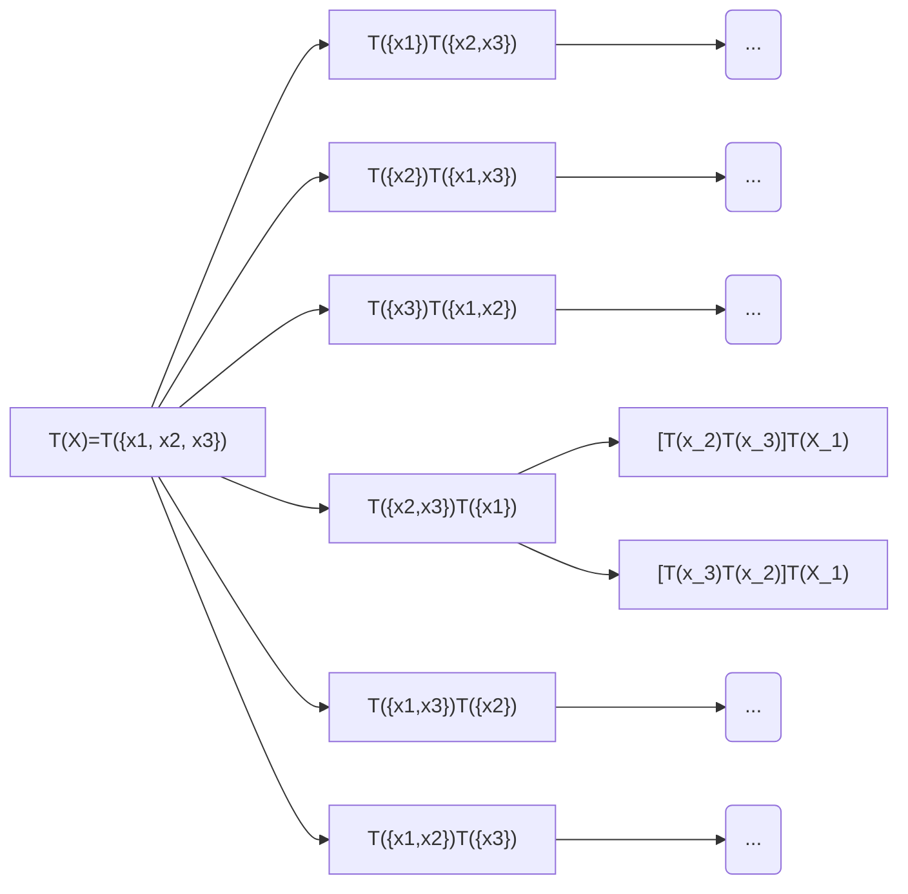

# VE490 Weekly Report 6

[TOC]

## Work Done:

* Successfully set up the `vcs` system. Runned some test on it.
* Trying to use math to rigouriously decribe the algorithm. Worked out the maths.

## Experiment on the curren *End to End* procedure.

Contraints and assumptions:
* All simplified MFFCss has at most 6 inputs.
* Both of them have limited amount of input. This allows us to run all inputs. Besides VCS is simply a test runner. The inputs are manually generated.

| Source Circuit | Error Rate (10 Iteration) | Size Ratio |
| -------------- | ------------------------- | ---------- |
| rfile9         | 0.88%                     | 93%        |
| rfile6         | 1.32%                     | 95%        |

It's hard to tell whether this is good or bad. On one hand only a few circuits are tested, and the size reduction is not significant. On the other hand, the error rate looks good. Since tests are manaully runned, thus we cannot do a lot of iterations, it's unkown if whether the system has converged or not.

## A mathematical frame work for proving things
The goal of this is to derive a mathematical framework that describes our search process. Using it we should be able to proof or disproof assumptions in the algorithms, or analyze the impact of various branch-bounding techniques.

## Definitions:

We would like to make the following definition:

* Define the set of  input variables as set $X$, e.g. for 6 input circuit, 
$$
X = \{x_1, x_2, x_3, x_4, x_5, x_6\}
$$

* Define $T(X)$ as a set of full binary trees, such that:
$$
T(X):=\{\text{Full Binary Trees that }X\text{ are all leaves}\}
$$
Note especially, if $X$ is the set of all input variable, then $T(X) essentially denotes the entire search space.

* Given $t_1 \in T_1(X_1)$, $t_2 \in T_2(X_1)$, futher require $X_1 \cap X_2 = \emptyset$, denote $C(t_1, t_2)$
$$
C(t_1, t_2):= \text{A binary tree with $t_1$ as left child and $t_2$ as right child.}
$$
Note that $ C(t_1, t_2) $ is considered not equivalent to $C(t_2, t_1)$. This reflects the property that Wang's algorithm perfers the row over column when decompsing.

* Given some valid $T(X_1)$ and $T(X_2)$, denote the operator $\otimes$ as
$$
T(X_1)\otimes T(X_2):=\{C(t_1, t_2):t_1\in T(X_1) \land t_2\in T(x_2)\}
$$
Note since $C(\cdot, \cdot)$ is asymmetric, thus $(\cdot \otimes \cdot)$ is also not symmetric. This operator is considered as the product of 2 sets of binary trees. It can be ommitted in the following content if no confusion should arrise.

## Using the notations to describe the process of searching.
We would like to formulate the process of decomposing a target function as a search problem. Thus it's very important to make clear what will be the search space (i.e. what are we searching and in what set are we searching). The process of searching, though represented in a tree diagram, actually denotes the process of breaking down the search space (i.e. breaking up the original set into smaller sets). 

To make sure every case is covered and every case is covered only once. We must require that the broken down subsets must not overlap with each other. We would also require that they combined to the original set (thus) nothing is lost. 

We would like to represent our idea in the tree graph. Each node denotes a set. The set contains the search space under this node. A node contains child nodes. Each child node denotes a subset of the parent. 

For example, consider searching a solution for a 3 input function.

$F(x_1, x_2, x_3)$. By our definition, $X={x_1, x_2, x_3}$.  We would re-express the idea of "Covered all cases once and at most once" as "The sets that is represented by the  child nodes of a parent node, must form the original sets when unioned, and must be empty when arbitrary of two are intersected". This statement becomes a provable property of the algorithm.

### Footnote, the distribute rule

We ommit the proof for now. I'd like to keep this weekly simple because there are other more important content. But a fact I believe is worth mentioning.

The $\otimes$ operator works very much like a "product", or essentially a "Cartesian Product". Together with the "Union" operator, these 2 will follow a "distribute rule", i.e. given a list of mutually exclusive set of full binary trees $X_1, X_2, ...$
$$
\left(\bigcup\limits_{i\in\{1,2,3...\}}X_i\right)\otimes T(Y) = \bigcup\limits_{i\in\{1,2,3...\}}[X_i \otimes T(Y)]
$$
This can be proved from definition.

## Decomposition and approxiamation and errors

The process of searching contains branch eliminations and estimating. A lot of assumptions are related to the "error" of a decomposition. Thus it will be worth while to model the idea of "decomposition" and "error" more carefully. 

### Decomposition
*This section requires refinement*
In principle there many more ways of breaking down a parent node search space. But we would want to limit the break-done only to those "Decomposable" ones. In particular, we would like to make statments like "All trees in the set of this node can be composite from this node". Thus we would like to associate with every node a boolean function. 

### Error Estimation
We first define what an error is, using the usual diffintion. Assuming function $f$ and $g$ are defined on the same set $X$, then the error of the function, denote as $E[f, g]$:
$$
E[f, g] = \text{card} \{x \in X  : f(x)\neq g(x)\}
$$
Then natrually the error rate $ER[f, g]$:
$$
ER[f, g] = E[f, g] / \text{card} X
$$
In order to preform branch elimination, we must estimate the worst case scenario. We make our first attempt to define the **Global Minimum Error** of a node. Assume the function that we try to approximate is $F(X)$. Given a set of full binary trees $T$, the Global Minimum Error of this set $T$, is
$$
\mathrm{GMin}(T):=\min\limits_{t\in T}\{E[\tilde{t}, F]\}
$$
Essentially branch elimination, including branch and bound, relies on the estimation of the lower bound of the Global Minimum Error. It is clear that
$$
T_c\subset T_p \implies \mathrm{GMin}(T) \geq \mathrm{GMin}(T_p)
$$
This also translates to the fact that the global minimum of a child node is always larger then the global minimum of a parent node. Notice that the Global Minimum Error of leaf node, which contains one tree only, is by definition the error that particular decomposition. Thus we can naturally use the global minimum of a higher level node to estimate the lower bound of the final decomposited error.

This is a prelimenary result. Clearly there exists other type of errors. We will study how they are related and how to estimate them in the future.

#### Footnote
We have a small problem here. We assume that given a Tree stucture, this is one and one only equation that corresponds to the structure. This is clearly not true. But we can argue, if we choose the decompositing function uniquely in each stage. Given a struture, its corresponds to a unique equation. There is also no guarantee that this equation is indeed the best of all the options in this tree structure. We simply assumes that the way we decomposites gives this property.

